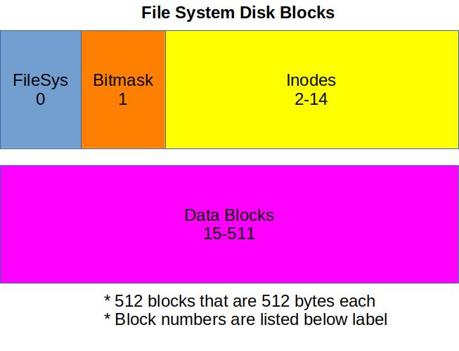

## Assignment 6: File System

#### RAM FILESYSTEM

#### 1.0 Objective

In this assignment, you will be implementing a file system that is modeled after the ext2 file system. This file system will be implemented completely in RAM. You are provided with the filesystem structures and functions to manipulate blocks. Additionally, you are provided with test functions and a shell command to exercise your solution.

You will be implementing core system calls to interact with the file system. fs is used as a prefix to the commands to differentiate between the functions already in Xinu and your new functions. These functions will be developed in fs.c.

- fs_open
- fs_close
- fs_create
- fs_seek
- fs_read
- fs_write

The files that you will be using are included in the course xinu repository. You will need to do a pull from the course repository to get these new files. The new files are as follows:

- system/fs.c: This file will contain the fs_x system calls that you will be implementing. This is where you will spend your time in this assignment.
- system/bs.c: This contains the functions used to read and write blocks of data for our file system. The blocks for this file system are stored entirely in RAM.
- shell/xsh_fstest.c: This file contains the code for the fstest command. This command has been added to the shell and should be available once you pull the latest version of the repository.
- include/fs.h: Structures and other configuration information for the file system.

You will be implementing the functions listed above in system/fs.c such that the fstest shell command completes successfully. You should review the code in xsh_fstest.c to understand exactly how the testing is being done.

#### 2.0 References
You may find the following references related to ext2 helpful in the development of your solution. They describe the ext2 filesystem. The filesystem that you are developing is highly simplified but has many of the traits of ext2.

- [The Ext2 File System](https://github.iu.edu/SICE-OS/P536-F18/wiki/docs/ext2.pdf)
- [Ext2 Lab at Smith College](http://cs.smith.edu/~nhowe/262/oldlabs/ext2.html)
- [Operating Systems: Three Easy Pieces - File System Implementation](http://pages.cs.wisc.edu/~remzi/OSTEP/file-implementation.pdf)

#### 3.0 Key Filesystem Structures

The structures used in the file system are defined in include/fs.h.

#### 3.1 File System Block

This is metadata about the file system. It is analogous to the superblock in ext2. In this filesystem it is written to block 0 of the file system. It is created in fs_mkfs located in system/fs.c:

    /* write the fsystem block to SB_BLK, mark block used */
    fs_setmaskbit(SB_BLK);                                     // Mark block 0 as used in the block management bitmask. 
    bs_bwrite(dev0, SB_BLK, 0, &fsd, sizeof(struct fsystem));  // Write the fsystem struct data to block 0 

The structure of the data contained in the block is defined in include/fs.h.

    struct fsystem {
      int nblocks;
      int blocksz;
      int ninodes;
      int inodes_used;
      int freemaskbytes;
      char *freemask;
      struct directory root_dir;
    };

This includes information about the filesystem. Additionally, this block provides the root directory structure. This directory structure provides the entry point into the file systems. Directory structures are discussed in the Inode section of this document.

#### 3.2 Block Bitmask

The block bitmask is a byte array that is stored in block 1 of the file system. This array of bytes will be used to locate a free block when one is needed for a file. This block is used to mark block are used (1) or empty (0). Each byte of the array stores 8 bits - one for each of 8 blocks.

The array is created in It is created in fs_mkfs located in system/fs.c:

    i = fsd.nblocks;               // Set i to the number of blocks in this file system
    while ( (i % 8) != 0) {i++;}   // Increment i until it is evenly divisible by 8. 
	                             // Each byte represents the state of 8 blocks. 
    fsd.freemaskbytes = i / 8;     // compute the total number of bytes needed by the freemask. 

    /* Allocate memory for the freemask array */
    if ((fsd.freemask = getmem(fsd.freemaskbytes)) == (void *)SYSERR) { 
      printf("fs_mkfs memget failed.\n");
      return SYSERR;
    }
  
    /* zero the free mask to indicate that it is completely empty */
    for(i=0;i<fsd.freemaskbytes;i++) {
      fsd.freemask[i] = '\0';
    }

    ...
  
    /* write the free block bitmask in BM_BLK, mark block used */
    fs_setmaskbit(BM_BLK);                                          // Sets the bitmask for block 1 in the freemask array.
    bs_bwrite(dev0, BM_BLK, 0, fsd.freemask, fsd.freemaskbytes);    // commit the freemask array to block 1 of the filesystem. 
 
#### 3.3 Inode

The inode is the entry point to all files and directories. Inodes are stored starting in FIRST\_INODE_BLOCK (defined in system/fs.c).

    #define FIRST_INODE_BLOCK 2

Multiple inodes are stored in each block. There are 12 inode blocks defined for this file system.

    #define INODEBLOCKS 12

This limit and the size of 1 inode structure limits the total number of inodes available to the filesystem. Since multiple inodes are store per inode block, the total number of inodes is dependent on the size of a block and the size of each inode structure.

    #define INODES_PER_BLOCK (fsd.blocksz / sizeof(struct inode))
    #define NUM_INODE_BLOCKS (( (fsd.ninodes % INODES_PER_BLOCK) == 0) ? fsd.ninodes / INODES_PER_BLOCK : (fsd.ninodes / INODES_PER_BLOCK) + 1)

The structure of a single inode is defined as the following from include/fs.h:

    /* Structure of inode*/
    struct inode {
      int id;
      short int type;
      short int nlink;
      int device;
      int size;
      int blocks[INODEBLOCKS];
    };

An inode can be one of two types defined in include/fs.h

    #define INODE_TYPE_FILE 1
    #define INODE_TYPE_DIR 2

#### 3.3.1 File

The type of an inode indicates whether this inode refers to a file or to a directory. If the type is a file, the data for a file is stored in the block numbers indicated in the blocks array of the inode. The index of the block in the array indicates the position of the block in the file. The size element of the inode structure will indicate how many bytes the file contains.

#### 3.3.2 Directory

If the type of the inode is a directory, then the data blocks of the inode contain a directory structure. This directory is defined in include/fs.h.

    /*Struct to store directory details*/
    struct directory {
      int numentries;
      struct dirent entry[DIRECTORY_SIZE];
    };

The directory structure contains an array of directory entries. A directory entry provides a linkage between an inode number and a text name. An entry can refer to either a file or a directory.

    /*Struct to store directory entry*/
    struct dirent {
      int inode_num;
      char name[FILENAMELEN];
    };

The root directory is stored in block 0 as part of the fsystem structure.

    /*Struct to file system details*/
    struct fsystem {
      int nblocks;
      int blocksz;
      int ninodes;
      int inodes_used;
      int freemaskbytes;
      char *freemask;
      struct directory root_dir;
    }

#### 4.0 Instructions

The following funnctions are defined in system/fs.c:

- fs_open
- fs_close
- fs_create
- fs_seek
- fs_read
- fs_write
- fs_mount

You challenge in this assignment is to complete these functions such that you can successfully run the fstest command.

Once you have completed the functions and are successfully running fstest, you should write a report that includes the following:

- Description of your implementation of these functions.
- lessons learned.

5.0 Grading

- fs_open function (5 pts)
- fs_close function (5 pts)
- fs_create function (5 pts)
- fs_seek function (5 pts)
- fs_read function (5 pts)
- fs_write function (5 pts)
- File system passes the fstest (50 pts)
- Report (20 pts)
